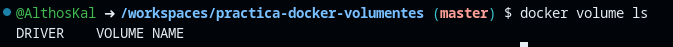

# **Practica de Docker con Volumenes**

## **Laboratorio: Trabajando con Volumenes en Docker**

### **Estudio de la Teoría**

---

## **1. Información General**
- **Laboratorio N°:** Gestión de volúmenes en Docker.
- **Objetivo:** Aprender a crear, administrar, compartir y realizar copias de seguridad de volúmenes en Docker.

---

## **2. Capturas de Pantalla y Evidencias**

### **2.1 Comprensión de las opciones de almacenamiento de Docker**
#### **Ejecución del comando:**
```bash
docker volume ls
```

**Descripción:**  
Se ejecuta el comando para listar los volúmenes existentes en el sistema.

#### **Resultado Obtenido:**
**Captura del Resultado:**


**Descripción:**  
El comando muestra los volúmenes existentes en el sistema, incluyendo detalles como el nombre y el controlador.

---

### **2.2 Creación y administración de volúmenes con nombre**
#### **Ejecución del comando:**
```bash
docker volume create my_data
docker volume ls
docker volume inspect my_data
```

**Descripción:**  
Se crea un nuevo volumen llamado `my_data`, se lista los volúmenes y se inspecciona el volumen creado.

#### **Resultado Obtenido:**
**Captura del Resultado:**
[Captura de los detalles del volumen `my_data`](ruta o direccion a la imagen "Salida")

**Descripción:**  
El comando `docker volume inspect` muestra detalles como la fecha de creación, el punto de montaje y el nombre del volumen.

---

### **2.3 Uso de volúmenes con contenedores**
#### **Ejecución del comando:**
```bash
docker run -d --name my_container -v my_data:/app/data ubuntu:latest sleep infinity
docker exec my_container sh -c "echo 'Hello from Docker volume' > /app/data/test.txt"
docker exec my_container cat /app/data/test.txt
```

**Descripción:**  
Se ejecuta un contenedor con el volumen `my_data` montado, se crea un archivo en el volumen y se verifica su contenido.

#### **Resultado Obtenido:**
**Captura del Resultado:**
[Captura del contenido del archivo `test.txt`](ruta o direccion a la imagen "Salida")

**Descripción:**  
El comando muestra el contenido del archivo `test.txt`, confirmando que los datos se han escrito correctamente en el volumen.

---

### **2.4 Compartir datos entre contenedores**
#### **Ejecución del comando:**
```bash
docker run -d --name another_container -v my_data:/app/shared_data ubuntu:latest sleep infinity
docker exec another_container cat /app/shared_data/test.txt
docker exec another_container sh -c "echo 'Data from another container' >> /app/shared_data/test.txt"
docker exec my_container cat /app/data/test.txt
```

**Descripción:**  
Se ejecuta un segundo contenedor que comparte el mismo volumen, se verifica el acceso a los datos y se agrega nueva información al archivo.

#### **Resultado Obtenido:**
**Captura del Resultado:**
[Captura del contenido actualizado del archivo `test.txt`](ruta o direccion a la imagen "Salida")

**Descripción:**  
El comando muestra el contenido actualizado del archivo `test.txt`, confirmando que ambos contenedores pueden acceder y modificar los mismos datos.

---

### **2.5 Copia de seguridad y restauración de volumen**
#### **Ejecución del comando:**
```bash
docker stop my_container another_container
docker rm my_container another_container
docker run --rm -v my_data:/source:ro -v $(pwd):/backup ubuntu tar cvf /backup/my_data_backup.tar -C /source .
docker volume rm my_data
docker volume create my_restored_data
docker run --rm -v my_restored_data:/dest -v $(pwd):/backup ubuntu bash -c "tar xvf /backup/my_data_backup.tar -C /dest"
docker run --rm -v my_restored_data:/app/data ubuntu cat /app/data/test.txt
```

**Descripción:**  
Se realiza una copia de seguridad del volumen, se elimina el volumen original, se crea un nuevo volumen y se restaura la copia de seguridad. Finalmente, se verifica que los datos se han restaurado correctamente.

#### **Resultado Obtenido:**
**Captura del Resultado:**
[Captura del contenido restaurado del archivo `test.txt`](ruta o direccion a la imagen "Salida")

**Descripción:**  
El comando muestra el contenido del archivo `test.txt` después de la restauración, confirmando que los datos se han recuperado correctamente.

---

## **3. Resultados y Análisis**

### **3.1 Resultados Obtenidos**
- Se creó y administró un volumen Docker llamado `my_data`.
- Se utilizó el volumen en un contenedor y se verificó que los datos se almacenaron correctamente.
- Se compartió el volumen entre dos contenedores y se confirmó que ambos podían acceder y modificar los mismos datos.
- Se realizó una copia de seguridad del volumen, se eliminó el volumen original y se restauró la copia de seguridad en un nuevo volumen.

### **3.2 Análisis**
- Los volúmenes Docker son una herramienta poderosa para la persistencia de datos en contenedores.
- La capacidad de compartir volúmenes entre contenedores facilita la colaboración y el intercambio de datos.
- Las operaciones de copia de seguridad y restauración son esenciales para garantizar la integridad de los datos en entornos de producción.
- Estos resultados cumplen con los objetivos del laboratorio, demostrando las habilidades necesarias para gestionar volúmenes en Docker.

---
---

### **Laboratorio**

# **Gestión del volumen de datos**

## **1. Información General**
- **Laboratorio N°:** Creación y gestión de un volumen de datos en Docker.
- **Objetivo:** Aprender a crear un volumen de datos, inspeccionar sus detalles y agregar archivos al volumen.

---

## **2. Capturas de Pantalla y Evidencias**

### **2.1 Creación de un volumen de datos**
#### **Ejecución del comando:**
```bash
docker volume create my-vol
docker volume ls
```

**Descripción:**  
Se crea un nuevo volumen llamado `my-vol` y se lista los volúmenes existentes para verificar que se ha creado correctamente.

#### **Resultado Obtenido:**
**Captura del Resultado:**
[Captura de la lista de volúmenes](ruta o direccion a la imagen "Salida")

**Descripción:**  
El comando `docker volume ls` muestra que el volumen `my-vol` ha sido creado exitosamente.

---

### **2.2 Inspección del volumen de datos**
#### **Ejecución del comando:**
```bash
docker volume inspect my-vol
```

**Descripción:**  
Se inspecciona el volumen `my-vol` para obtener detalles como el punto de montaje (`Mountpoint`).

#### **Resultado Obtenido:**
**Captura del Resultado:**
[Captura de los detalles del volumen `my-vol`](ruta o direccion a la imagen "Salida")

**Descripción:**  
El comando muestra detalles del volumen, incluyendo el `Mountpoint`, que indica la ruta en el sistema host donde se almacenan los datos.

---

### **2.3 Creación de un archivo en el volumen**
#### **Ejecución del comando:**
```bash
sudo su
cd /var/lib/docker/volumes/my-vol/_data
echo "Hello from Docker volume" > test.txt
ls
```

**Descripción:**  
Se cambia al usuario `root`, se navega al `Mountpoint` del volumen y se crea un archivo `test.txt` con contenido.

#### **Resultado Obtenido:**
**Captura del Resultado:**
[Captura del archivo `test.txt` creado](ruta o direccion a la imagen "Salida")

**Descripción:**  
El comando `ls` muestra que el archivo `test.txt` ha sido creado correctamente en el volumen.

---

## **3. Resultados y Análisis**

### **3.1 Resultados Obtenidos**
- Se creó un volumen de datos llamado `my-vol`.
- Se inspeccionó el volumen para obtener detalles como el `Mountpoint`.
- Se creó un archivo `test.txt` en el volumen y se verificó su existencia.

### **3.2 Análisis**
- El comando `docker volume create` permite crear volúmenes de datos de manera sencilla.
- La inspección del volumen con `docker volume inspect` proporciona información detallada, como la ruta de montaje en el sistema host.
- La creación de archivos en el volumen demuestra cómo los datos pueden persistir y ser accesibles desde el sistema host.
- Estos resultados cumplen con los objetivos del laboratorio, demostrando las habilidades necesarias para gestionar volúmenes de datos en Docker.

---

# **Creación de contenedores con volumen de datos**

## **1. Información General**
- **Laboratorio N°:** Creación de un contenedor con un volumen de datos y copia de archivos.
- **Objetivo:** Aprender a crear un volumen de datos, montarlo en un contenedor y copiar archivos desde el sistema host al contenedor.

---

## **2. Capturas de Pantalla y Evidencias**

### **2.1 Creación de un volumen de datos**
#### **Ejecución del comando:**
```bash
docker volume create nginx-vol
docker volume ls
```

**Descripción:**  
Se crea un nuevo volumen llamado `nginx-vol` y se lista los volúmenes existentes para verificar que se ha creado correctamente.

#### **Resultado Obtenido:**
**Captura del Resultado:**
[Captura de la lista de volúmenes](ruta o direccion a la imagen "Salida")

**Descripción:**  
El comando `docker volume ls` muestra que el volumen `nginx-vol` ha sido creado exitosamente.

---

### **2.2 Creación de un contenedor con el volumen montado**
#### **Ejecución del comando:**
```bash
docker run -d --name nginx -v nginx-vol:/usr/share/nginx/html nginx
docker ps | grep nginx
```

**Descripción:**  
Se ejecuta un contenedor llamado `nginx` basado en la imagen oficial de Nginx, montando el volumen `nginx-vol` en el directorio `/usr/share/nginx/html`.

#### **Resultado Obtenido:**
**Captura del Resultado:**
[Captura del contenedor `nginx` en ejecución](ruta o direccion a la imagen "Salida")

**Descripción:**  
El comando `docker ps` muestra que el contenedor `nginx` está en ejecución y utiliza el volumen `nginx-vol`.

---

### **2.3 Creación de un archivo local**
#### **Ejecución del comando:**
```bash
echo "hello world" > /tmp/index.html
cat /tmp/index.html
```

**Descripción:**  
Se crea un archivo `index.html` en el directorio `/tmp` con el contenido "hello world".

#### **Resultado Obtenido:**
**Captura del Resultado:**
[Captura del contenido del archivo `index.html`](ruta o direccion a la imagen "Salida")

**Descripción:**  
El comando `cat` muestra el contenido del archivo `index.html`, confirmando que se ha creado correctamente.

---

### **2.4 Copia del archivo al contenedor**
#### **Ejecución del comando:**
```bash
docker cp /tmp/index.html nginx:/usr/share/nginx/html/index.html
docker exec nginx cat /usr/share/nginx/html/index.html
```

**Descripción:**  
Se copia el archivo `index.html` desde el sistema host al contenedor `nginx` en el directorio `/usr/share/nginx/html`.

#### **Resultado Obtenido:**
**Captura del Resultado:**
[Captura del contenido del archivo en el contenedor](ruta o direccion a la imagen "Salida")

**Descripción:**  
El comando `docker exec` muestra el contenido del archivo `index.html` dentro del contenedor, confirmando que se ha copiado correctamente.

---

## **3. Resultados y Análisis**

### **3.1 Resultados Obtenidos**
- Se creó un volumen de datos llamado `nginx-vol`.
- Se ejecutó un contenedor `nginx` montando el volumen en el directorio `/usr/share/nginx/html`.
- Se creó un archivo `index.html` en el sistema host y se copió al contenedor.
- Se verificó que el archivo se copió correctamente y está accesible dentro del contenedor.

### **3.2 Análisis**
- El comando `docker volume create` permite crear volúmenes de datos para persistir información.
- El comando `docker run` con la opción `-v` permite montar volúmenes en contenedores, lo que es útil para compartir datos entre el host y el contenedor.
- El comando `docker cp` facilita la copia de archivos entre el sistema host y el contenedor.
- Estos resultados cumplen con los objetivos del laboratorio, demostrando las habilidades necesarias para gestionar volúmenes y copiar archivos en Docker.

---

# **Crear contenedores con ruta de host**

## **1. Información General**
- **Laboratorio N°:** Creación de un contenedor utilizando una ruta de host para la persistencia de datos.
- **Objetivo:** Aprender a montar un directorio del sistema host en un contenedor y verificar la persistencia de datos.

---

## **2. Capturas de Pantalla y Evidencias**

### **2.1 Creación de un directorio en el host**
#### **Ejecución del comando:**
```bash
mkdir /tmp/nginx
ls /tmp | grep nginx
```

**Descripción:**  
Se crea un directorio llamado `nginx` en `/tmp` y se verifica que se ha creado correctamente.

#### **Resultado Obtenido:**
**Captura del Resultado:**
[Captura del directorio `nginx` creado](ruta o direccion a la imagen "Salida")

**Descripción:**  
El comando `ls` muestra que el directorio `nginx` ha sido creado exitosamente en `/tmp`.

---

### **2.2 Creación de un contenedor con montaje de ruta de host**
#### **Ejecución del comando:**
```bash
docker run -d --name nginx-host -v /tmp/nginx:/usr/share/nginx/html nginx
docker ps | grep nginx-host
```

**Descripción:**  
Se ejecuta un contenedor llamado `nginx-host` basado en la imagen oficial de Nginx, montando el directorio `/tmp/nginx` del host en el directorio `/usr/share/nginx/html` del contenedor.

#### **Resultado Obtenido:**
**Captura del Resultado:**
[Captura del contenedor `nginx-host` en ejecución](ruta o direccion a la imagen "Salida")

**Descripción:**  
El comando `docker ps` muestra que el contenedor `nginx-host` está en ejecución y utiliza el montaje de ruta de host.

---

### **2.3 Verificación de los detalles de montaje**
#### **Ejecución del comando:**
```bash
docker inspect nginx-host
```

**Descripción:**  
Se inspecciona el contenedor `nginx-host` para verificar los detalles del montaje de la ruta de host.

#### **Resultado Obtenido:**
**Captura del Resultado:**
```bash
@AlthosKal ➜ /workspaces/practica-docker-volumentes (master) $ docker inspect nginx-host
[
    {
        "Id": "3523c592f409beb1ff15cdd56c2d495d68bb6128dc897af03c89bbba75ba9ebc",
        "Created": "2025-03-17T18:43:03.920380552Z",
        "Path": "/docker-entrypoint.sh",
        "Args": [
            "nginx",
            "-g",
            "daemon off;"
        ],
        "State": {
            "Status": "running",
            "Running": true,
            "Paused": false,
            "Restarting": false,
            "OOMKilled": false,
            "Dead": false,
            "Pid": 38963,
            "ExitCode": 0,
            "Error": "",
            "StartedAt": "2025-03-17T18:43:03.997917111Z",
            "FinishedAt": "0001-01-01T00:00:00Z"
        },
        "Image": "sha256:b52e0b094bc0e26c9eddc9e4ab7a64ce0033c3360d8b7ad4ff4132c4e03e8f7b",
        "ResolvConfPath": "/var/lib/docker/containers/3523c592f409beb1ff15cdd56c2d495d68bb6128dc897af03c89bbba75ba9ebc/resolv.conf",
        "HostnamePath": "/var/lib/docker/containers/3523c592f409beb1ff15cdd56c2d495d68bb6128dc897af03c89bbba75ba9ebc/hostname",
        "HostsPath": "/var/lib/docker/containers/3523c592f409beb1ff15cdd56c2d495d68bb6128dc897af03c89bbba75ba9ebc/hosts",
        "LogPath": "/var/lib/docker/containers/3523c592f409beb1ff15cdd56c2d495d68bb6128dc897af03c89bbba75ba9ebc/3523c592f409beb1ff15cdd56c2d495d68bb6128dc897af03c89bbba75ba9ebc-json.log",
        "Name": "/nginx-host",
        "RestartCount": 0,
        "Driver": "overlay2",
        "Platform": "linux",
        "MountLabel": "",
        "ProcessLabel": "",
        "AppArmorProfile": "docker-default",
        "ExecIDs": null,
        "HostConfig": {
            "Binds": [
                "/tmp/nginx:/usr/share/nginx/html"
            ],
            "ContainerIDFile": "",
            "LogConfig": {
                "Type": "json-file",
                "Config": {}
            },
            "NetworkMode": "bridge",
            "PortBindings": {},
            "RestartPolicy": {
                "Name": "no",
                "MaximumRetryCount": 0
            },
            "AutoRemove": false,
            "VolumeDriver": "",
            "VolumesFrom": null,
            "ConsoleSize": [
                21,
                192
            ],
            "CapAdd": null,
            "CapDrop": null,
            "CgroupnsMode": "private",
            "Dns": [],
            "DnsOptions": [],
            "DnsSearch": [],
            "ExtraHosts": null,
            "GroupAdd": null,
            "IpcMode": "private",
            "Cgroup": "",
            "Links": null,
            "OomScoreAdj": 0,
            "PidMode": "",
            "Privileged": false,
            "PublishAllPorts": false,
            "ReadonlyRootfs": false,
            "SecurityOpt": null,
            "UTSMode": "",
            "UsernsMode": "",
            "ShmSize": 67108864,
            "Runtime": "runc",
            "Isolation": "",
            "CpuShares": 0,
            "Memory": 0,
            "NanoCpus": 0,
            "CgroupParent": "",
            "BlkioWeight": 0,
            "BlkioWeightDevice": [],
            "BlkioDeviceReadBps": [],
            "BlkioDeviceWriteBps": [],
            "BlkioDeviceReadIOps": [],
            "BlkioDeviceWriteIOps": [],
            "CpuPeriod": 0,
            "CpuQuota": 0,
            "CpuRealtimePeriod": 0,
            "CpuRealtimeRuntime": 0,
            "CpusetCpus": "",
            "CpusetMems": "",
            "Devices": [],
            "DeviceCgroupRules": null,
            "DeviceRequests": null,
            "MemoryReservation": 0,
            "MemorySwap": 0,
            "MemorySwappiness": null,
            "OomKillDisable": null,
            "PidsLimit": null,
            "Ulimits": [],
            "CpuCount": 0,
            "CpuPercent": 0,
            "IOMaximumIOps": 0,
            "IOMaximumBandwidth": 0,
            "MaskedPaths": [
                "/proc/asound",
                "/proc/acpi",
                "/proc/kcore",
                "/proc/keys",
                "/proc/latency_stats",
                "/proc/timer_list",
                "/proc/timer_stats",
                "/proc/sched_debug",
                "/proc/scsi",
                "/sys/firmware",
                "/sys/devices/virtual/powercap"
            ],
            "ReadonlyPaths": [
                "/proc/bus",
                "/proc/fs",
                "/proc/irq",
                "/proc/sys",
                "/proc/sysrq-trigger"
            ]
        },
        "GraphDriver": {
            "Data": {
                "LowerDir": "/var/lib/docker/overlay2/c8ec080a3ac13747881a2f42a3d2338ef31fe995cc3789f80d97f8d94609608b-init/diff:/var/lib/docker/overlay2/c4e435c2ab5aa2ea6991728e94f6b001998cf44cdeb2500ce4b51ee0990ab3c3/diff:/var/lib/docker/overlay2/b48b7a1962ade3507a7e682560d7f5f8f3a830d511d0e43a3606c19ab7bd8fe2/diff:/var/lib/docker/overlay2/f44bc7d97f47715bbcd6544cdf4eee8e0c45563715ab08ab130c0e1f991b0bc6/diff:/var/lib/docker/overlay2/fad21caa0408dc3d6982fb53e12a0c18f587b1666f9c540afe7570503de38d0f/diff:/var/lib/docker/overlay2/0a5ff62ce7ecdbada10313ca25bf0ad6452d72f4ce0535271bc570ae3246f2f0/diff:/var/lib/docker/overlay2/4af28162d8a7eed2867769b6559d3fbfed5c367dfce65e739f89baaf1e329fed/diff:/var/lib/docker/overlay2/d02ede24a805cd85d81579873e90801adf8d91ae456c57a14c1da32fe9a6c859/diff",
                "MergedDir": "/var/lib/docker/overlay2/c8ec080a3ac13747881a2f42a3d2338ef31fe995cc3789f80d97f8d94609608b/merged",
                "UpperDir": "/var/lib/docker/overlay2/c8ec080a3ac13747881a2f42a3d2338ef31fe995cc3789f80d97f8d94609608b/diff",
                "WorkDir": "/var/lib/docker/overlay2/c8ec080a3ac13747881a2f42a3d2338ef31fe995cc3789f80d97f8d94609608b/work"
            },
            "Name": "overlay2"
        },
        "Mounts": [
            {
                "Type": "bind",
                "Source": "/tmp/nginx",
                "Destination": "/usr/share/nginx/html",
                "Mode": "",
                "RW": true,
                "Propagation": "rprivate"
            }
        ],
        "Config": {
            "Hostname": "3523c592f409",
            "Domainname": "",
            "User": "",
            "AttachStdin": false,
            "AttachStdout": false,
            "AttachStderr": false,
            "ExposedPorts": {
                "80/tcp": {}
            },
            "Tty": false,
            "OpenStdin": false,
            "StdinOnce": false,
            "Env": [
                "PATH=/usr/local/sbin:/usr/local/bin:/usr/sbin:/usr/bin:/sbin:/bin",
                "NGINX_VERSION=1.27.4",
                "NJS_VERSION=0.8.9",
                "NJS_RELEASE=1~bookworm",
                "PKG_RELEASE=1~bookworm",
                "DYNPKG_RELEASE=1~bookworm"
            ],
            "Cmd": [
                "nginx",
                "-g",
                "daemon off;"
            ],
            "Image": "nginx",
            "Volumes": null,
            "WorkingDir": "",
            "Entrypoint": [
                "/docker-entrypoint.sh"
            ],
            "OnBuild": null,
            "Labels": {
                "maintainer": "NGINX Docker Maintainers <docker-maint@nginx.com>"
            },
            "StopSignal": "SIGQUIT"
        },
        "NetworkSettings": {
            "Bridge": "",
            "SandboxID": "f2672f4a17b5eeb68bef44d68dc0054905fad5d6d68235711e77974cc3ec2944",
            "SandboxKey": "/var/run/docker/netns/f2672f4a17b5",
            "Ports": {
                "80/tcp": null
            },
            "HairpinMode": false,
            "LinkLocalIPv6Address": "",
            "LinkLocalIPv6PrefixLen": 0,
            "SecondaryIPAddresses": null,
            "SecondaryIPv6Addresses": null,
            "EndpointID": "b60ac365bc82fc82b994ed503869a13ae8248b1e2fdb1371eaed56cea54eda79",
            "Gateway": "172.17.0.1",
            "GlobalIPv6Address": "",
            "GlobalIPv6PrefixLen": 0,
            "IPAddress": "172.17.0.3",
            "IPPrefixLen": 16,
            "IPv6Gateway": "",
            "MacAddress": "02:42:ac:11:00:03",
            "Networks": {
                "bridge": {
                    "IPAMConfig": null,
                    "Links": null,
                    "Aliases": null,
                    "MacAddress": "02:42:ac:11:00:03",
                    "DriverOpts": null,
                    "NetworkID": "fbe487ce70710fcf9608b1b6a69eee582a8fe27229efbfe8d8d04bb47984aaf7",
                    "EndpointID": "b60ac365bc82fc82b994ed503869a13ae8248b1e2fdb1371eaed56cea54eda79",
                    "Gateway": "172.17.0.1",
                    "IPAddress": "172.17.0.3",
                    "IPPrefixLen": 16,
                    "IPv6Gateway": "",
                    "GlobalIPv6Address": "",
                    "GlobalIPv6PrefixLen": 0,
                    "DNSNames": null
                }
            }
        }
    }
]
```

**Descripción:**  
El comando muestra que el directorio `/tmp/nginx` del host está montado en `/usr/share/nginx/html` del contenedor.

---

### **2.4 Creación de un archivo en el host**
#### **Ejecución del comando:**
```bash
echo "hello nginx" > /tmp/nginx/nginx.txt
cat /tmp/nginx/nginx.txt
```

**Descripción:**  
Se crea un archivo `nginx.txt` en el directorio `/tmp/nginx` con el contenido "hello nginx".

#### **Resultado Obtenido:**
**Captura del Resultado:**
[Captura del contenido del archivo `nginx.txt`](ruta o direccion a la imagen "Salida")

**Descripción:**  
El comando `cat` muestra el contenido del archivo `nginx.txt`, confirmando que se ha creado correctamente.

---

### **2.5 Verificación del archivo en el contenedor**
#### **Ejecución del comando:**
```bash
docker exec nginx-host cat /usr/share/nginx/html/nginx.txt
```

**Descripción:**  
Se verifica que el archivo `nginx.txt` está accesible dentro del contenedor.

#### **Resultado Obtenido:**
**Captura del Resultado:**
[Captura del contenido del archivo en el contenedor](ruta o direccion a la imagen "Salida")

**Descripción:**  
El comando muestra el contenido del archivo `nginx.txt` dentro del contenedor, confirmando que el montaje de ruta de host funciona correctamente.

---

## **3. Resultados y Análisis**

### **3.1 Resultados Obtenidos**
- Se creó un directorio `/tmp/nginx` en el sistema host.
- Se ejecutó un contenedor `nginx-host` montando el directorio `/tmp/nginx` en `/usr/share/nginx/html`.
- Se verificó que el montaje de ruta de host está configurado correctamente.
- Se creó un archivo `nginx.txt` en el host y se verificó que está accesible dentro del contenedor.

### **3.2 Análisis**
- El montaje de rutas de host permite compartir datos entre el sistema host y el contenedor de manera eficiente.
- El comando `docker inspect` es útil para verificar los detalles de configuración de los contenedores, como los montajes.
- La creación y verificación de archivos en el host y el contenedor demuestra que los datos persisten y son accesibles desde ambos lados.
- Estos resultados cumplen con los objetivos del laboratorio, demostrando las habilidades necesarias para trabajar con rutas de host en Docker.

---

# **Compartir datos entre contenedores**

## **1. Información General**
- **Laboratorio N°:** Compartir datos entre contenedores utilizando montajes de ruta de host.
- **Objetivo:** Aprender a compartir datos entre dos contenedores montando un directorio del host en ambos contenedores.

---

## **2. Capturas de Pantalla y Evidencias**

### **2.1 Creación de un directorio en el host**
#### **Ejecución del comando:**
```bash
mkdir /tmp/share
ls -ld /tmp/share
```

**Descripción:**  
Se crea un directorio llamado `share` en `/tmp` y se verifica que se ha creado correctamente.

#### **Resultado Obtenido:**
**Captura del Resultado:**
[Captura del directorio `share` creado](ruta o direccion a la imagen "Salida")

**Descripción:**  
El comando `ls` muestra que el directorio `share` ha sido creado exitosamente en `/tmp`.

---

### **2.2 Creación del contenedor `nginx-share`**
#### **Ejecución del comando:**
```bash
docker run -d --name nginx-share -v /tmp/share:/usr/share/nginx/html nginx
docker ps | grep nginx-share
```

**Descripción:**  
Se ejecuta un contenedor llamado `nginx-share` basado en la imagen oficial de Nginx, montando el directorio `/tmp/share` del host en el directorio `/usr/share/nginx/html` del contenedor.

#### **Resultado Obtenido:**
**Captura del Resultado:**
[Captura del contenedor `nginx-share` en ejecución](ruta o direccion a la imagen "Salida")

**Descripción:**  
El comando `docker ps` muestra que el contenedor `nginx-share` está en ejecución y utiliza el montaje de ruta de host.

---

### **2.3 Creación del contenedor `busybox-share`**
#### **Ejecución del comando:**
```bash
docker run -d --name busybox-share -v /tmp/share:/usr/share/nginx/html busybox sleep infinity
docker ps | grep busybox-share
```

**Descripción:**  
Se ejecuta un contenedor llamado `busybox-share` basado en la imagen `busybox`, montando el mismo directorio `/tmp/share` del host en el directorio `/usr/share/nginx/html` del contenedor.

#### **Resultado Obtenido:**
**Captura del Resultado:**
[Captura del contenedor `busybox-share` en ejecución](ruta o direccion a la imagen "Salida")

**Descripción:**  
El comando `docker ps` muestra que el contenedor `busybox-share` está en ejecución y utiliza el mismo montaje de ruta de host que `nginx-share`.

---

### **2.4 Creación de un archivo en el host**
#### **Ejecución del comando:**
```bash
echo "hello share" > /tmp/share/share.txt
cat /tmp/share/share.txt
```

**Descripción:**  
Se crea un archivo `share.txt` en el directorio `/tmp/share` con el contenido "hello share".

#### **Resultado Obtenido:**
**Captura del Resultado:**
[Captura del contenido del archivo `share.txt`](ruta o direccion a la imagen "Salida")

**Descripción:**  
El comando `cat` muestra el contenido del archivo `share.txt`, confirmando que se ha creado correctamente.

---

### **2.5 Verificación del archivo en el contenedor `nginx-share`**
#### **Ejecución del comando:**
```bash
docker exec nginx-share cat /usr/share/nginx/html/share.txt
```

**Descripción:**  
Se verifica que el archivo `share.txt` está accesible dentro del contenedor `nginx-share`.

#### **Resultado Obtenido:**
**Captura del Resultado:**
[Captura del contenido del archivo en `nginx-share`](ruta o direccion a la imagen "Salida")

**Descripción:**  
El comando muestra el contenido del archivo `share.txt` dentro del contenedor `nginx-share`, confirmando que el montaje de ruta de host funciona correctamente.

---

### **2.6 Verificación del archivo en el contenedor `busybox-share`**
#### **Ejecución del comando:**
```bash
docker exec busybox-share cat /usr/share/nginx/html/share.txt
```

**Descripción:**  
Se verifica que el archivo `share.txt` está accesible dentro del contenedor `busybox-share`.

#### **Resultado Obtenido:**
**Captura del Resultado:**
[Captura del contenido del archivo en `busybox-share`](ruta o direccion a la imagen "Salida")

**Descripción:**  
El comando muestra el contenido del archivo `share.txt` dentro del contenedor `busybox-share`, confirmando que ambos contenedores comparten los mismos datos.

---

## **3. Resultados y Análisis**

### **3.1 Resultados Obtenidos**
- Se creó un directorio `/tmp/share` en el sistema host.
- Se ejecutaron dos contenedores (`nginx-share` y `busybox-share`) montando el mismo directorio `/tmp/share` en ambos.
- Se creó un archivo `share.txt` en el host y se verificó que está accesible en ambos contenedores.

### **3.2 Análisis**
- El montaje de rutas de host permite compartir datos entre múltiples contenedores de manera eficiente.
- Ambos contenedores pueden acceder y modificar los mismos datos almacenados en el directorio compartido del host.
- Estos resultados cumplen con los objetivos del laboratorio, demostrando las habilidades necesarias para compartir datos entre contenedores utilizando montajes de ruta de host.